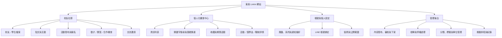
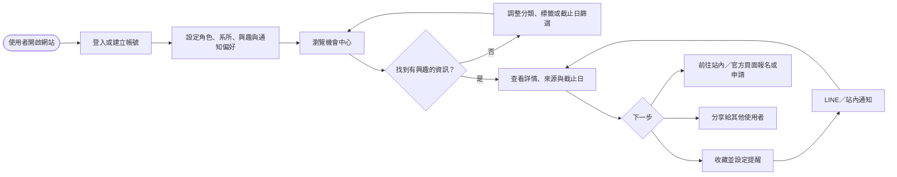
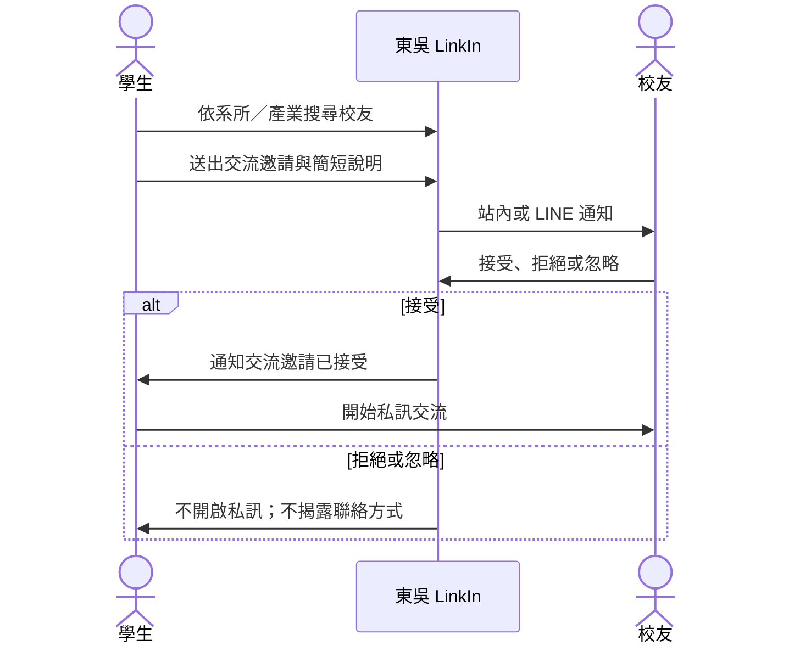
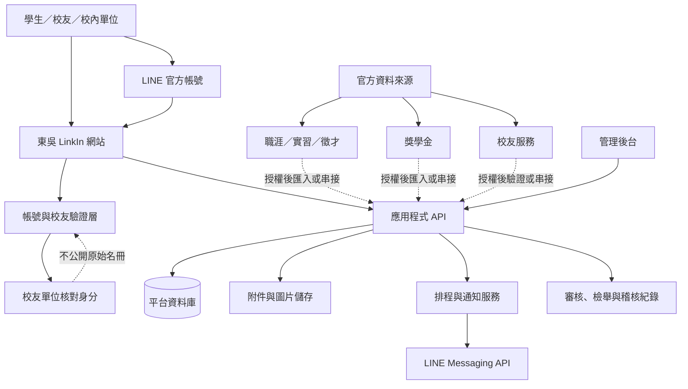
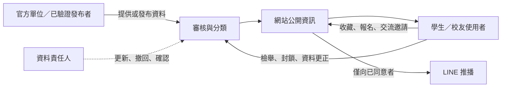

# 東吳 LinkIn：設計與技術架構圖

> 版本：0.1（概念設計）  
> 狀態：供 Phase 0 討論使用；SSO 串接暫不納入 MVP。資料授權、雲端服務與 LINE 管理權責仍待確認。

## 1. 產品資訊架構

## 2. MVP 主要使用流程

## 3. 校友交流流程

## 4. 初步技術架構

## 5. 初步資料流與責任界線

## 6. 尚未定案的技術決策

| 決策項目 | 目前設計假設 | 確認條件 |
| --- | --- | --- |
| 身分登入 | MVP 不串接校方 SSO | 未來如需導入，再由資訊單位提供串接資格、協定及安全要求 |
| 校友驗證 | 由校友單位核對，平台不公開原始名冊 | 校友單位確認可用欄位、同意與審核流程 |
| 官方資料匯入 | 先採授權人工發布或定期匯入，再評估 API | 資料單位同意來源、頻率、欄位與撤回機制 |
| LINE 推播 | 網站觸發、LINE 導回詳情頁 | 確認帳號歸屬、預算、推播頻率與同意流程 |
| 技術堆疊 | Web 前端、API、關聯式資料庫與排程服務 | K 依校方環境、資安與維運資源定案 |
